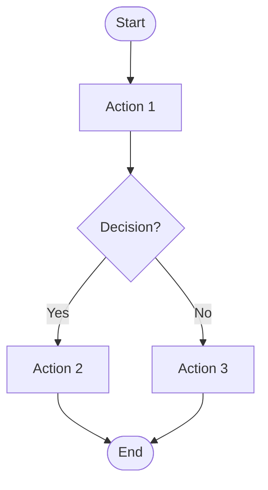

# 📊 Flowchart Creation Guide

## What is a Flowchart?

A flowchart is a visual representation of a process or workflow using symbols and arrows to show the flow of information or steps.

## Tools for Creating Flowcharts

### 1. **Mermaid (Recommended - Code-Based)**
- ✅ Free and open-source
- ✅ Can be embedded in markdown files
- ✅ Works with GitHub, GitLab, VS Code
- ✅ Version controllable (text-based)

### 2. **Online Tools**
- **Draw.io (diagrams.net)**: https://app.diagrams.net
- **Lucidchart**: https://www.lucidchart.com
- **Mermaid Live Editor**: https://mermaid.live

### 3. **Desktop Software**
- **Microsoft Visio** (Windows)
- **OmniGraffle** (Mac)

---

## Step-by-Step: Creating Your First Flowchart

### Step 1: Define Your Process
Think about what you want to document:
- What starts the process?
- What are the decision points?
- What are the possible outcomes?
- Where does it end?

### Step 2: Choose Your Symbols

Common flowchart symbols:
```
┌─────────┐
│   ┌──┐  │  Rectangle = Process/Step
│   └──┘  │
└─────────┘

┌─────────┐
│  ╱     ╲ │  Diamond = Decision (Yes/No)
│ │  Yes? │ │
│  ╲     ╱ │
└─────────┘

┌─────────┐
│ Start/  │  Rounded Rectangle = Start/End
│  End    │
└─────────┘

     │
     ▼
   Arrow = Flow direction
```

### Step 3: Write Your Flowchart

#### Example: Simple Login Flow
```
Start
  │
  ▼
┌─────────────┐
│ User opens  │
│ login page  │
└─────────────┘
  │
  ▼
┌─────────────┐
│ Enter       │
│ credentials │
└─────────────┘
  │
  ▼
┌─────────────┐
│ Valid?      │ ← Decision
└─────────────┘
  │        │
  │ Yes    │ No
  │        │
  ▼        ▼
┌──────────┐  ┌──────────┐
│ Redirect │  │ Show     │
│ to       │  │ error    │
│ dashboard│  └──────────┘
└──────────┘      │
                  │
                  ▼
              ┌──────────┐
              │ Try      │
              │ again    │
              └──────────┘
                  │
                  ▼
                 End
```

---

## Creating Flowcharts with Mermaid

Mermaid uses simple text syntax. Here's how:

### Basic Syntax



### Symbols in Mermaid:
- `([text])` = Rounded rectangle (Start/End)
- `[text]` = Rectangle (Process)
- `{text}` = Diamond (Decision)
- `((text))` = Circle (Optional connector)

---

## Ready-Made Flowcharts for Your System

I'll create several flowcharts for your intern attendance system:

1. **User Authentication Flow** - Signup & Login
2. **Attendance Clock In/Out Flow**
3. **Leave Application Flow**
4. **Volume Logs Flow**
5. **Admin Review Workflow**

Each flowchart will be in a separate file that you can view and edit!


