# 🔄 Complete System Flow: From Login/Signup

This flowchart shows the complete user journey from the moment they land on the system through all possible paths.

## 📊 Main System Flowchart

```mermaid
flowchart TD
    Start([User Visits System]) --> CheckAuth{Already Logged In?}
    
    CheckAuth -->|No| HomePage[🏠 Home Page]
    CheckAuth -->|Yes| CheckSession{Session Valid?}
    
    CheckSession -->|Valid| GetRole[Get User Role]
    CheckSession -->|Invalid| HomePage
    
    HomePage --> UserChoice{What to Do?}
    UserChoice -->|New User| Signup[📝 Sign Up]
    UserChoice -->|Existing User| Login[🔐 Login]
    
    %% ===== SIGNUP FLOW =====
    Signup --> FillSignupForm[Fill Registration Form:<br/>• Full Name<br/>• Username<br/>• Email<br/>• Phone Number<br/>• Address<br/>• Department<br/>• Emergency Contact<br/>• Password]
    
    FillSignupForm --> ValidateForm{Form Valid?}
    ValidateForm -->|No| ShowErrors[Show Validation Errors]
    ShowErrors --> FillSignupForm
    
    ValidateForm -->|Yes| SendVerification[Send Verification Code<br/>via Email]
    SendVerification --> VerificationStep[Enter Verification Code]
    
    VerificationStep --> VerifyCode{Code Correct?}
    VerifyCode -->|No| ShowCodeError[Show Code Error]
    ShowCodeError --> VerificationStep
    
    VerifyCode -->|Yes| CreateAccount[✅ Create Account in Database]
    CreateAccount --> SignupSuccess[Account Created Successfully!]
    SignupSuccess --> AutoLogin[Auto-login to System]
    AutoLogin --> GetRole
    
    %% ===== LOGIN FLOW =====
    Login --> EnterCredentials[Enter Credentials:<br/>• Username<br/>• Password]
    
    EnterCredentials --> ValidateLogin{Credentials Valid?}
    ValidateLogin -->|No| ShowLoginError[Show Error Message]
    ShowLoginError --> EnterCredentials
    
    ValidateLogin -->|Yes| CheckActive{Account Active?}
    CheckActive -->|No| ShowInactiveError[Account is Inactive]
    ShowInactiveError --> End([End])
    
    CheckActive -->|Yes| SetCookies[Set Authentication Cookies:<br/>• isAuthenticated: true<br/>• currentUserId]
    SetCookies --> StoreLocal[Store User Data in LocalStorage]
    StoreLocal --> GetRole
    
    %% ===== ROLE-BASED ROUTING =====
    GetRole --> CheckUserRole{User Role?}
    
    CheckUserRole -->|Admin| AdminDashboard[👨‍💼 Admin Dashboard]
    CheckUserRole -->|Intern| InternDashboard[👤 Intern Dashboard]
    
    %% ===== ADMIN DASHBOARD PATHS =====
    AdminDashboard --> AdminMenu{Admin Options}
    
    AdminMenu -->|Manage Interns| InternManagement[📋 Intern Management:<br/>• View All Interns<br/>• Search & Filter<br/>• View Intern Details<br/>• Edit Intern Info]
    
    AdminMenu -->|Review Leaves| LeaveReview[📝 Leave Review Queue:<br/>• View Pending Requests<br/>• Approve/Reject<br/>• Add Reviewer Notes<br/>• Bulk Actions]
    
    AdminMenu -->|View Reports| ReportsPage[📊 Attendance Reports:<br/>• Monthly Reports<br/>• Department Filter<br/>• Export PDF/CSV<br/>• Statistics]
    
    AdminMenu -->|View Attendance| AdminAttendance[📅 Attendance Logs:<br/>• All Interns Attendance<br/>• Filter by Date/Dept]
    
    AdminMenu -->|View Logs| AdminLogs[📔 Volume Logs:<br/>• View All Intern Logs<br/>• Export Logs]
    
    InternManagement --> AdminDashboard
    LeaveReview --> AdminDashboard
    ReportsPage --> AdminDashboard
    AdminAttendance --> AdminDashboard
    AdminLogs --> AdminDashboard
    
    %% ===== INTERN DASHBOARD PATHS =====
    InternDashboard --> InternMenu{Intern Options}
    
    InternMenu -->|Clock In/Out| Attendance[⏰ Clock In/Out]
    InternMenu -->|Volume Logs| VolumeLogs[📝 Volume Logs]
    InternMenu -->|Leave Application| LeaveApp[📋 Leave Application]
    InternMenu -->|Attendance History| History[📊 Attendance History]
    InternMenu -->|Profile| Profile[👤 Profile Management]
    
    %% ===== ATTENDANCE FLOW =====
    Attendance --> CheckAlreadyClocked{Already Clocked In Today?}
    
    CheckAlreadyClocked -->|Yes| ClockOutFlow[Clock Out Process]
    CheckAlreadyClocked -->|No| ClockInFlow[Clock In Process]
    
    ClockInFlow --> RequestLocation[📍 Request Location Permission]
    RequestLocation --> ValidateLocation{Location Valid?<br/>Within 100m}
    
    ValidateLocation -->|No| LocationError[❌ Show Location Error]
    LocationError --> Attendance
    
    ValidateLocation -->|Yes| RequestCamera[📷 Request Camera Access]
    RequestCamera --> CapturePhoto[Capture Photo]
    CapturePhoto --> FaceVerify[🔍 Verify Face Recognition]
    
    FaceVerify --> FaceValid{Face Match?}
    FaceValid -->|No| FaceError[❌ Face Verification Failed]
    FaceError --> Attendance
    
    FaceValid -->|Yes| CheckTime{Current Time?}
    CheckTime -->|Before 8:00 AM| StatusOnTime[✅ Status: On Time]
    CheckTime -->|After 8:00 AM| StatusLate[⚠️ Status: Late]
    
    StatusOnTime --> SaveAttendance[💾 Save to Database]
    StatusLate --> SaveAttendance
    
    ClockOutFlow --> RequestLocationOut[📍 Request Location]
    RequestLocationOut --> ValidateLocationOut{Location Valid?}
    ValidateLocationOut -->|No| LocationError
    ValidateLocationOut -->|Yes| CapturePhotoOut[📷 Capture Clock Out Photo]
    CapturePhotoOut --> SaveClockOut[💾 Save Clock Out Time]
    SaveClockOut --> SuccessMessage[✅ Clock Out Successful]
    
    SaveAttendance --> SuccessMessage
    SuccessMessage --> InternDashboard
    
    %% ===== VOLUME LOGS FLOW =====
    VolumeLogs --> CheckTimeAccess{Current Time<br/>8 AM - 7 PM?}
    
    CheckTimeAccess -->|No| TimeError[❌ Only accessible 8 AM - 7 PM]
    TimeError --> InternDashboard
    
    CheckTimeAccess -->|Yes| CheckLogExists{Log Exists Today?}
    CheckLogExists -->|Yes| LoadExistingLog[Load Existing Log]
    CheckLogExists -->|No| CreateNewLog[Create New Log Entry]
    
    LoadExistingLog --> CheckEditable{Before 7 PM?}
    CheckEditable -->|No| ReadOnlyMode[📖 Read-Only Mode<br/>Log Locked After 7 PM]
    CheckEditable -->|Yes| EditMode[✏️ Edit Mode]
    
    CreateNewLog --> EditMode
    EditMode --> UserWrites[User Writes Log:<br/>• Enter tasks<br/>• List activities<br/>• Bullet points format]
    
    UserWrites --> SaveLog[💾 Save Log]
    SaveLog --> ValidateTime{Still Before 7 PM?}
    ValidateTime -->|No| SaveError[❌ Cannot edit after 7 PM]
    ValidateTime -->|Yes| SaveToDatabase[Save to Database]
    
    SaveToDatabase --> LogSuccess[✅ Log Saved Successfully]
    LogSuccess --> UpdateTable[Update All Logs Table]
    UpdateTable --> InternDashboard
    
    ReadOnlyMode --> ViewLogs[View Past Logs]
    ViewLogs --> InternDashboard
    SaveError --> EditMode
    
    %% ===== LEAVE APPLICATION FLOW =====
    LeaveApp --> FillLeaveForm[Fill Leave Application Form:<br/>• Start Date<br/>• End Date<br/>• Reason<br/>• Leave Type]
    
    FillLeaveForm --> SubmitLeave[Submit Leave Request]
    SubmitLeave --> SavePending[💾 Save as Pending Status]
    SavePending --> LeaveSubmitted[✅ Leave Request Submitted]
    LeaveSubmitted --> InternDashboard
    
    %% ===== LEAVE REVIEW (Admin Side) =====
    LeaveReview --> LoadPendingLeaves[Load Pending Leave Requests]
    LoadPendingLeaves --> DisplayTable[Display in Review Table]
    
    DisplayTable --> AdminAction{Admin Action}
    AdminAction -->|Approve| ApproveLeave[✅ Approve Leave]
    AdminAction -->|Reject| RejectLeave[❌ Reject Leave]
    AdminAction -->|View Details| ViewLeaveDetails[View Full Details]
    
    ApproveLeave --> AddNote[Add Reviewer Note]
    AddNote --> UpdateApproved[Update Status: Approved]
    UpdateApproved --> NotifyIntern[📧 Notify Intern]
    
    RejectLeave --> AddRejectNote[Add Rejection Note]
    AddRejectNote --> UpdateRejected[Update Status: Rejected]
    UpdateRejected --> NotifyIntern
    
    NotifyIntern --> RefreshTable[Refresh Review Table]
    RefreshTable --> DisplayTable
    ViewLeaveDetails --> DisplayTable
    
    %% ===== ATTENDANCE HISTORY =====
    History --> LoadHistory[Load Attendance Records]
    LoadHistory --> DisplayHistory[Display History Table:<br/>• Date<br/>• Clock In Time<br/>• Clock Out Time<br/>• Status<br/>• Photos]
    DisplayHistory --> InternDashboard
    
    %% ===== PROFILE MANAGEMENT =====
    Profile --> ViewProfile[View Profile Information]
    ViewProfile --> EditProfile{Want to Edit?}
    
    EditProfile -->|Yes| UpdateProfile[Update Profile:<br/>• Full Name<br/>• Address<br/>• Phone<br/>• Emergency Contact]
    EditProfile -->|No| InternDashboard
    
    UpdateProfile --> SaveProfile[💾 Save Changes]
    SaveProfile --> ProfileUpdated[✅ Profile Updated]
    ProfileUpdated --> InternDashboard
    
    %% ===== LOGOUT =====
    AdminDashboard --> LogoutOption{Logout?}
    InternDashboard --> LogoutOption
    
    LogoutOption -->|Yes| ClearCookies[Clear Authentication Cookies]
    ClearCookies --> ClearLocalStorage[Clear LocalStorage]
    ClearLocalStorage --> RedirectHome[Redirect to Home Page]
    RedirectHome --> HomePage
    
    LogoutOption -->|No| Continue[Continue Using System]
    Continue --> AdminMenu
    Continue --> InternMenu
    
    %% Styling
    style Start fill:#40e0d0,stroke:#333,stroke-width:3px
    style End fill:#ff6b6b,stroke:#333,stroke-width:2px
    style AdminDashboard fill:#40e0d0,stroke:#333,stroke-width:2px
    style InternDashboard fill:#40e0d0,stroke:#333,stroke-width:2px
    style SignupSuccess fill:#95e1d3,stroke:#333,stroke-width:2px
    style SuccessMessage fill:#95e1d3,stroke:#333,stroke-width:2px
    style LogSuccess fill:#95e1d3,stroke:#333,stroke-width:2px
    style ProfileUpdated fill:#95e1d3,stroke:#333,stroke-width:2px
    style LeaveSubmitted fill:#95e1d3,stroke:#333,stroke-width:2px
    style LocationError fill:#ff6b6b,stroke:#333,stroke-width:2px
    style FaceError fill:#ff6b6b,stroke:#333,stroke-width:2px
    style TimeError fill:#ff6b6b,stroke:#333,stroke-width:2px
    style SaveError fill:#ff6b6b,stroke:#333,stroke-width:2px
```

## 📖 How to Read This Flowchart

### **Flow Direction**
- Follow the arrows (→) from top to bottom
- Start at the top: "User Visits System"
- End points are marked with rounded rectangles: ([End])

### **Symbols Explained**
- **Rounded Rectangle** `([Start/End])` = Start or End point
- **Rectangle** `[Process]` = An action or process step
- **Diamond** `{Decision?}` = A question/decision point
- **Arrows** `-->` = Flow direction
- **Labels on arrows** `|Yes|` or `|No|` = Conditions

### **Color Coding**
- 🟦 **Turquoise** = Main dashboards and start points
- 🟩 **Green** = Success actions
- 🟥 **Red** = Errors or end points
- ⬜ **White** = Regular processes

## 🔍 Key Paths Explained

### **Path 1: New User Journey**
1. Start → Home Page → Sign Up
2. Fill Form → Verification → Create Account
3. Auto-login → Get Role → Dashboard

### **Path 2: Existing User Journey**
1. Start → Home Page → Login
2. Enter Credentials → Validate → Set Cookies
3. Get Role → Dashboard

### **Path 3: Admin Journey**
1. Login → Admin Dashboard
2. Choose: Intern Management, Leave Review, Reports, etc.
3. Perform actions → Return to Dashboard

### **Path 4: Intern Journey**
1. Login → Intern Dashboard
2. Choose: Clock In/Out, Volume Logs, Leave, History, Profile
3. Complete action → Return to Dashboard

## 📝 Breakdown of Major Flows

### **Signup Flow (Steps 1-10)**
- User fills registration form
- System validates form
- Email verification sent
- User enters code
- Account created
- Auto-login happens

### **Login Flow (Steps 11-20)**
- User enters credentials
- System validates
- Checks if account is active
- Sets cookies and localStorage
- Routes to appropriate dashboard

### **Clock In Flow (Steps 21-35)**
- Check if already clocked in
- Request location permission
- Validate location (within 100m)
- Request camera access
- Capture photo
- Face verification
- Check time for status (On Time/Late)
- Save to database

### **Volume Logs Flow (Steps 36-50)**
- Check time access (8 AM - 7 PM)
- Check if log exists
- Load or create log
- Check if editable (before 7 PM)
- User writes/edits log
- Save to database

## 🎯 Decision Points Summary

| Decision Point | Options | What Happens |
|---------------|---------|--------------|
| Already Logged In? | Yes / No | Go to dashboard or show home page |
| Form Valid? | Yes / No | Continue or show errors |
| Code Correct? | Yes / No | Create account or retry |
| Credentials Valid? | Yes / No | Login or show error |
| Account Active? | Yes / No | Continue or show inactive message |
| User Role? | Admin / Intern | Route to respective dashboard |
| Location Valid? | Yes / No | Continue or show error |
| Face Match? | Yes / No | Continue or show error |
| Time Before 8 AM? | Yes / No | Status: On Time or Late |
| Time 8 AM - 7 PM? | Yes / No | Allow access or show error |
| Before 7 PM? | Yes / No | Allow editing or read-only |

## 🔄 View This Flowchart

1. **GitHub**: Push to GitHub and view directly
2. **VS Code**: Install "Markdown Preview Mermaid Support" extension
3. **Online**: Copy code to https://mermaid.live
4. **Export**: Use Mermaid CLI to export as PNG/SVG

---

**This flowchart covers the complete system from login/signup through all user actions!**

