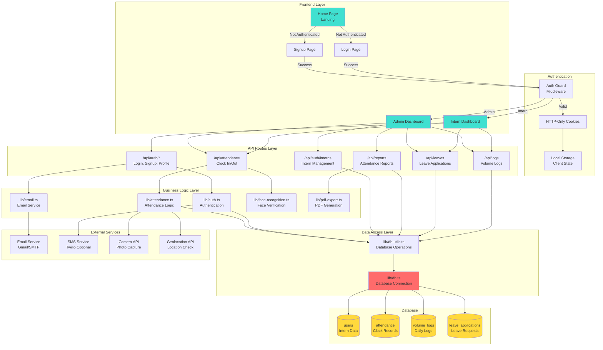
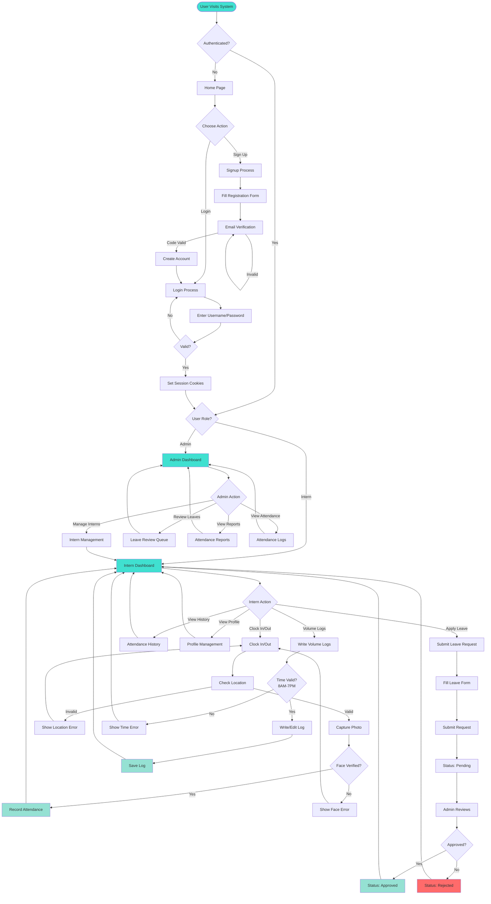
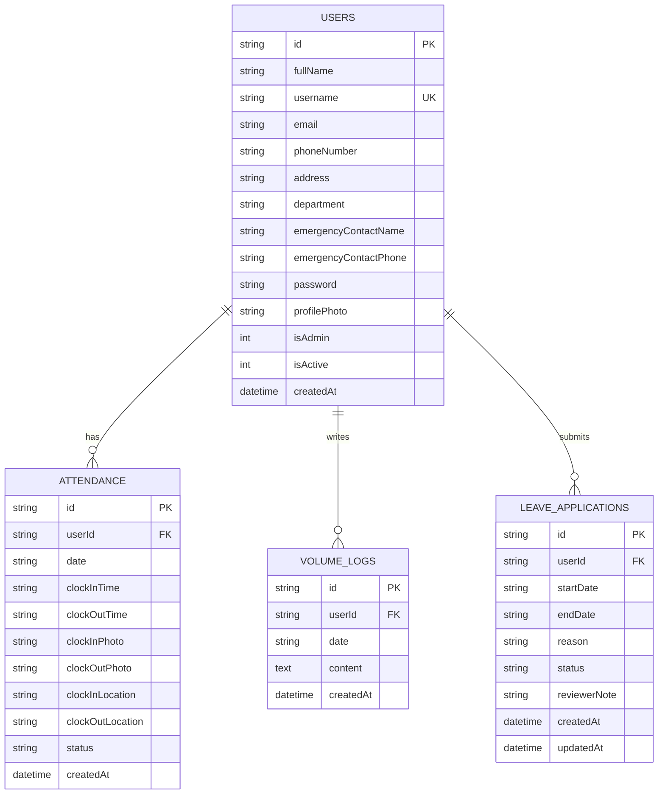
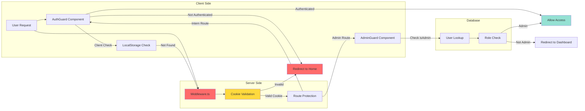
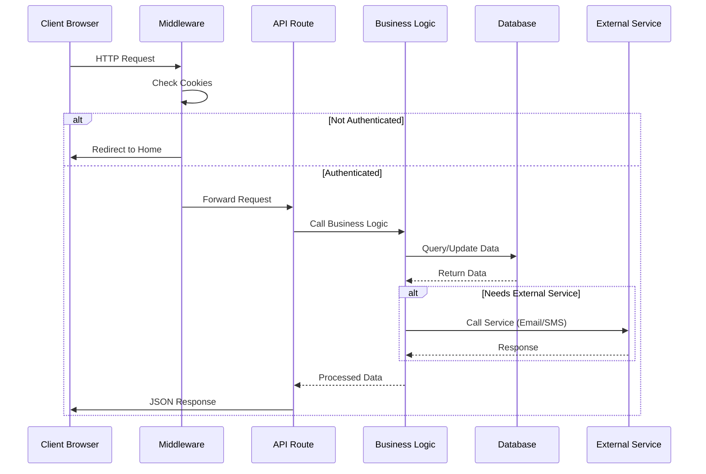
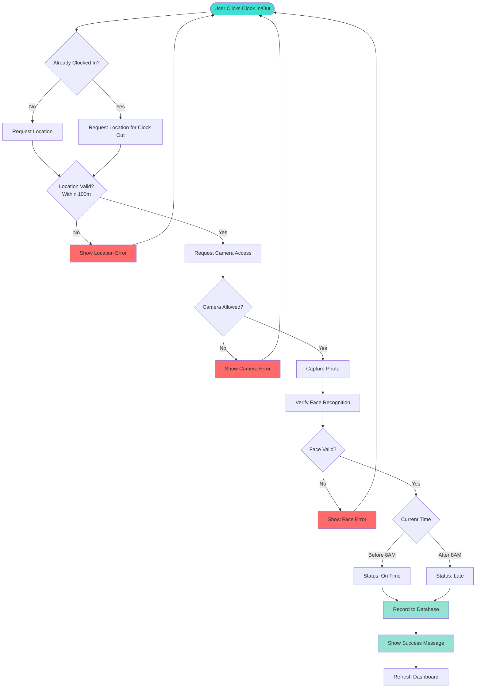
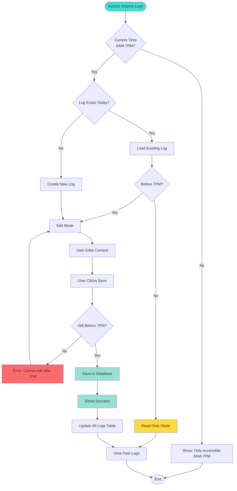
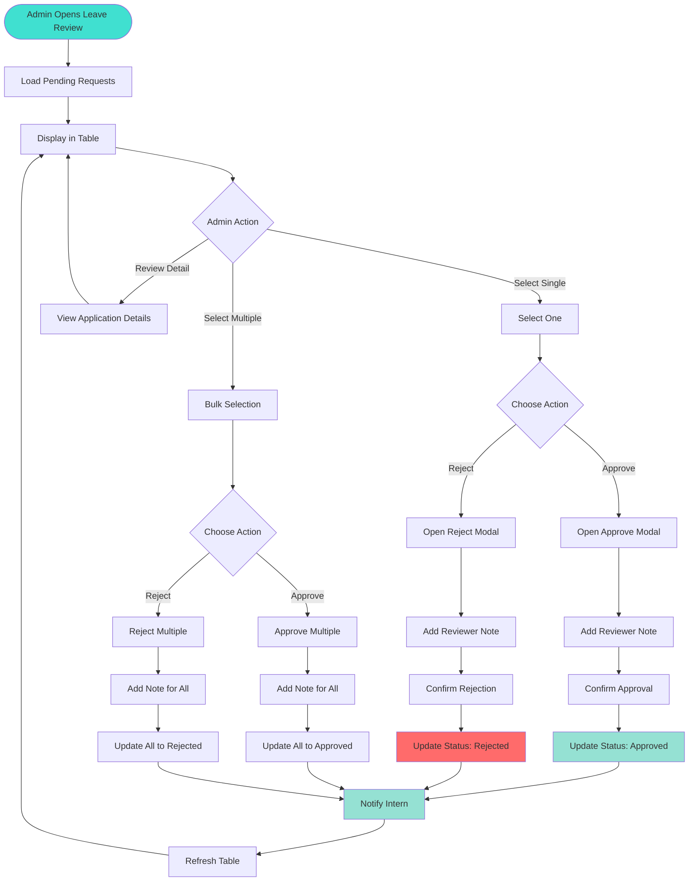
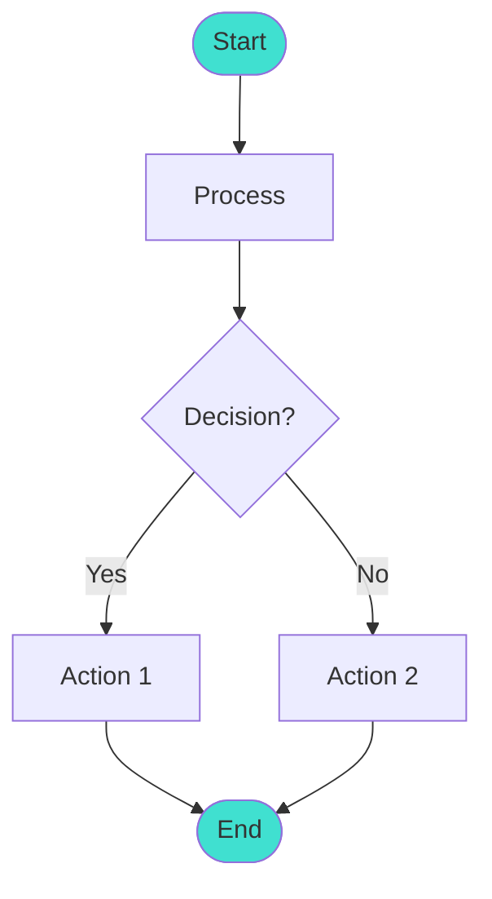

# 🏗️ Overall System Architecture Flowchart

This document contains flowcharts showing the complete system architecture of the Intern Attendance System.

## 📊 System Architecture Overview



## 🔄 Complete User Journey Flow



## 🗄️ Database Schema Flow



## 🔐 Authentication & Authorization Flow



## 📱 API Request Flow



## 🎯 Feature-Specific Flows

### Attendance Clock In/Out Flow



### Volume Logs Flow



### Leave Application Review Flow



## 📝 How to View These Flowcharts

### Option 1: GitHub (Recommended)
- Push this file to GitHub
- GitHub automatically renders Mermaid diagrams
- View directly in the repository

### Option 2: VS Code
- Install "Markdown Preview Mermaid Support" extension
- Open this file in VS Code
- Use Markdown preview to view

### Option 3: Online Viewer
- Go to https://mermaid.live
- Copy and paste the mermaid code blocks
- View and export as PNG/SVG

### Option 4: Mermaid CLI
```bash
npm install -g @mermaid-js/mermaid-cli
mmdc -i SYSTEM_ARCHITECTURE_FLOWCHART.md -o flowchart.png
```

## 🔧 Customizing Flowcharts

To edit these flowcharts:

1. **Modify the Mermaid code** - Edit the code blocks starting with ````mermaid`
2. **Add new nodes** - Use syntax like `NodeName[Label]`
3. **Add connections** - Use `-->` for arrows
4. **Add styling** - Use `style NodeName fill:#color`
5. **Add subgraphs** - Group related components

### Quick Reference:


## 📚 Additional Resources

- **Mermaid Documentation**: https://mermaid.js.org/
- **Flowchart Symbols Guide**: See FLOWCHART_GUIDE.md
- **Mermaid Live Editor**: https://mermaid.live

---

**Last Updated**: November 2025  
**System Version**: v1.0


